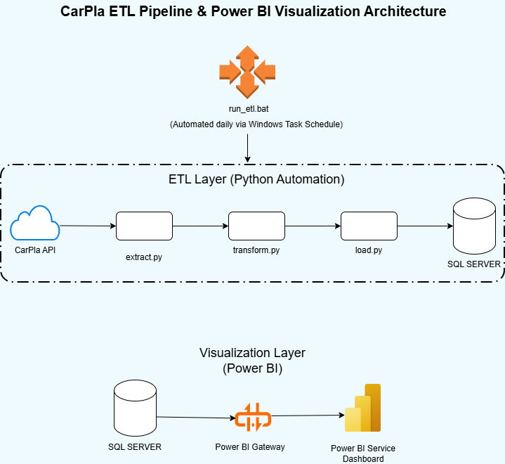

# CarPla ETL Pipeline & Power BI Visualization 🚗💨📊

This project implements an ETL (Extract, Transform, Load) pipeline to gather car and dealership data from the CarPla API, clean the data using Python, load it into a SQL Server database, and visualize key metrics using Power BI. The ETL process is automated daily using Windows Task Scheduler.

## Architecture Overview 🏗️

The diagram below illustrates the overall architecture of the pipeline and visualization process:




**Key Components:**

* **ETL Layer (Python Automation):** Orchestrated by `run_etl.bat`, this layer handles data extraction, transformation, and loading.
* **Data Source:** CarPla API (`api-ecom.carpla.vn`).
* **Data Storage:** SQL Server Database (`datawarehouse`).
* **Visualization Layer:** Uses Power BI connected to the SQL Server database via a Power BI Gateway to create interactive dashboards.
* **Automation:** The `run_etl.bat` script is scheduled for daily execution via Windows Task Scheduler.

## Technologies Used 💻

* Python 3.13 (as indicated in `run_etl.bat`)
* **Libraries:**
    * `requests`: For API calls.
    * `pandas`: For data manipulation and cleaning.
    * `numpy`: For numerical operations.
    * `pyodbc`: For SQL Server connection.
* SQL Server
* Windows Batch Script (`.bat`)
* Windows Task Scheduler (for automation)
* Power BI (Desktop for development, Service for viewing, Gateway for data refresh)


## Workflow ⚙️

1.  **Automation Trigger:** Windows Task Scheduler executes `scripts/run_etl.bat` daily.
2.  **Extract (`src/extract.py`):**
    * Fetches car listing data from the CarPla API.
    * Extracts relevant car and unique shop data.
    * Saves raw data locally (e.g., `car_data.csv`, `shop_data.csv` - not included in repo).
3.  **Transform (`src/transform.py`):**
    * Reads the raw local CSV files.
    * Performs data cleaning, standardization (numeric types, dates, text fields), and handling of missing values.
    * Removes duplicate shop entries.
    * Saves the cleaned dataframes to `data_cleaned/car_data_cleaned.csv` and `data_cleaned/shop_data_cleaned.csv`.
4.  **Load (`src/load.py`):**
    * Connects to the `datawarehouse` database on the local SQL Server.
    * Clears existing data from `Car` and `Shop` tables.
    * Reads the cleaned CSV files from `data_cleaned/`.
    * Inserts the cleaned data into the respective SQL Server tables.
5.  **Visualize (Power BI):**
    * A Power BI report connects to the SQL Server `datawarehouse` database (likely via a Power BI Gateway for scheduled refreshes in Power BI Service).
    * The report displays interactive dashboards based on the loaded car and shop data.

## Setup 🛠️

1.  **Prerequisites:**
    * Python 3.13 (or adjust path in `run_etl.bat`).
    * SQL Server instance running (script connects to `localhost`).
    * Database `datawarehouse` created in SQL Server.
    * **ODBC Driver 17 for SQL Server** installed.
    * Power BI Desktop (for viewing/editing the report) and potentially a Power BI Gateway (for scheduling refreshes if using Power BI Service).
2.  **Clone the repository:**
    ```bash
    git clone https://github.com/phulee9/btl_hqtri_csdl_carpla.git
    cd CarPla-ETL
    ```
3.  **Create and activate a virtual environment (Recommended):**
    ```bash
    python -m venv .venv
    .\.venv\Scripts\activate
    ```
4.  **Install dependencies:**
    ```bash
    pip install -r requirements.txt
    ```
5.  **Database Table Setup:** Create the `Shop` and `Car` tables in your `datawarehouse` database using the SQL script below:

    ```sql
    -- Create Shop table
    CREATE TABLE Shop (
        Shop_Slug NVARCHAR(255) PRIMARY KEY,
        Shop_Name NVARCHAR(255),
        Shop_Province NVARCHAR(100),
        Shop_Created_At DATE
    );

    -- Create Car table
    CREATE TABLE Car (
        Product_ID NVARCHAR(50) PRIMARY KEY,
        Title NVARCHAR(MAX),
        Price FLOAT,
        Year INT,
        Manufacturer NVARCHAR(100),
        Brand NVARCHAR(100),
        Origin NVARCHAR(100),
        Figure NVARCHAR(100),
        Seats INT,
        Gear NVARCHAR(50),
        Fuel NVARCHAR(50),
        Color NVARCHAR(50),
        Shop_Slug NVARCHAR(255),
        FOREIGN KEY (Shop_Slug) REFERENCES Shop(Shop_Slug)
    );
    ```

## Usage ▶️

**Running the ETL Pipeline:**

* **Automated:** Configure Windows Task Scheduler to run `scripts/run_etl.bat` on your desired schedule (e.g., daily).
* **Manual (Windows):** Navigate to the `scripts` directory and double-click `run_etl.bat`, or run it from the command line. Check `etl_log.txt` (created in `scripts`) for logs.
* **Manual (Cross-platform):** Activate your virtual environment. From the *root* directory (`CarPla-ETL`), run the scripts sequentially:
    ```bash
    python src/extract.py
    python src/transform.py
    python src/load.py
    ```

**Viewing the Visualization:**

* *(Assuming you have a Power BI file)* Open the corresponding `.pbix` file in Power BI Desktop.
* *(Or)* Access the published report through Power BI Service.
* Ensure the data source connection in Power BI points correctly to your SQL Server database.

## Output ✨

* Cleaned data files in `data_cleaned/`.
* Updated `Shop` and `Car` tables in the `datawarehouse` SQL Server database.
* Refreshed data in the Power BI dashboard (either manually or via scheduled refresh).